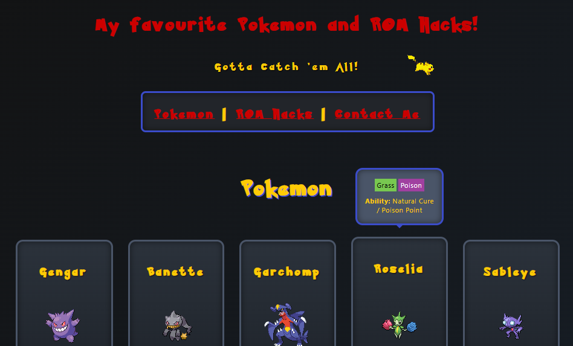

# Pokémon & ROM Hacks Portfolio | Mission 1

A responsive one-page website built to showcase fundamental HTML and CSS skills for Mission 1

The site has a custom Pokémon aesthetic complete with hover-reveal sprite animations, interactive type/ability tooltips, custom cursors, and a fully functional email contact form.



---

## Live Demo

To run this demo, install Live Server in VS Code. Click Go Live in the bottom right corner of VS Code and open port: 5500.

---

## Features & Highlights
* **Interactive Pokémon Cards:** Static sprite images dynamically swap to animated GIFs on hover, accompanied by sliding tooltip cards detailing types and abilities.
* **Custom Theme & Typography:** Implements a custom `@font-face` Pokémon font, dark gradient styling, and custom Cubone cursors for anchors and buttons.
* **Responsive Layouts:** Built utilizing modern CSS Grid for card alignment and Flexbox for component and navigation spacing.
* **Running Animation:** Features a continuous keyframe animation of a running Pikachu across the header track.
* **Contact Form:** Integrated via Formspree for handling inquiries directly.

---

## Tech Stack
* **HTML5:** Semantic structural elements (`<header>`, `<nav>`, `<main>`, `<section>`, `<footer>`, `<form>`,`<head>`, `<body>`, `<div>`, `<h1>`, `<p>`, ``, `<a>`, `Class` and `ID` attributes).
* **CSS3:** Custom properties, Flexbox, CSS Grid, Media Queries, and Keyframe Animations, background and font stylisation, margins, width & height properties, animations.

---

## Project Structure
```text
├── index.html       # Main HTML structure
├── main.css         # Complete stylesheet (fonts, grid, animations)
└── public/          # Sprites, logos, banners, and cursors#
